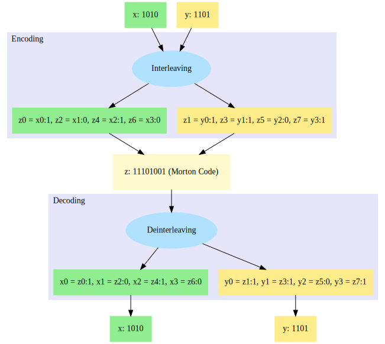

# Morton Code in Go

[](https://github.com/habedi/morton/actions/workflows/tests.yml)
[](https://goreportcard.com/report/github.com/habedi/morton)
[](https://pkg.go.dev/github.com/habedi/morton)
[](https://github.com/habedi/morton/blob/main/LICENSE)

This is an implementation of [Morton code](https://en.wikipedia.org/wiki/Z-order_curve) in Golang. It provides
functions for encoding 2D and 3D points into 1D and decoding them back to the original points. This package has no
external dependencies and provides an easy-to-use API.

I made this package to understand how Morton code works and also to learn how to write and publish Go packages. I hope
you find it useful.

## What is Morton code?

**Morton code** (also called the **Z-order curve**) is a way to convert multi-dimensional data points, like 2D or 3D
coordinates into single numbers while keeping nearby points close together. This is useful for things like spatial
indexing in [Quadtrees](https://en.wikipedia.org/wiki/Quadtree) and [Octrees](https://en.wikipedia.org/wiki/Octree), as
well as in computer graphics to make memory access faster.

The main idea is to **interleave** the bits of the numbers. For example, take the 2D point `(10, 13)`:

- `10` in binary is `1010`, and
- `13` in binary is `1101`.

By mixing the bits of these numbers via interleaving, we get `11011001`, which is `217` in decimal. This number is the
**Morton code**.

You can also reverse the process to get the original point back. This is done by **deinterleaving** the bits of the
Morton
code.

The image below shows how `(10, 13)` is turned into a Morton code and then is decoded back.

<p style="text-align: center;">
  
</p>

## Installation

You can install this package using `go get`:

```bash
go get github.com/habedi/morton

```

## Implemented Functions

The package provides the following functions:

| Function     | Input Signature                         | Output                                  | Comments                                                                                                      |
|--------------|-----------------------------------------|-----------------------------------------|---------------------------------------------------------------------------------------------------------------|
| **Encode2D** | (`x: uint32`, `y: uint32`)              | `code: uint64`                          | Encodes (`x`, `y`) into a Morton code.                                                                        |
| **Decode2D** | `code: uint64`                          | (`x: uint32`, `y: uint32`)              | Decodes `code` into its 2D representation.                                                                    |
| **Encode3D** | (`x: uint32`, `y: uint32`, `z: uint32`) | `uint64`                                | Encodes a (`x`, `y`, `z`) into a Morton code. <br/>Currently, `x`, `y`, and `z` can range from `0` to `2^21`. |                                     
| **Decode3D** | `code: uint64`                          | (`x: uint32`, `y: uint32`, `z: uint32`) | Decodes `code` into its 3D representation.                                                                    |

Note that the inputs and outputs are unsigned integers. So, negative numbers are not supported. Also, the maximum value
for `x`, `y`, and `z` is `2^21` (2,097,152) when encoding 3D points. So, bits beyond the 21st bit will be ignored for
encoding and decoding a 3D point.

## Usage

Below is an example of how to use this package to encode and decode 2D and 3D points.

```go
package main

import (
    "fmt"
    "github.com/habedi/morton"
)

func main() {

    // Encode and decode 2D
    demo2D(10, 13)

    // Encode and decode 3D
    demo3D(10, 13, 5)
}

func demo2D(x uint32, y uint32) {
    code := morton.Encode2D(x, y)
    fmt.Printf("Morton code of (%d, %d) is %d\n", x, y, code)

    x, y = morton.Decode2D(code)
    fmt.Printf("Decoded Morton code %d to (%d, %d)\n", code, x, y)
}

func demo3D(x uint32, y uint32, z uint32) {
    code := morton.Encode3D(x, y, z)
    fmt.Printf("Morton code of (%d, %d, %d) is %d\n", x, y, z, code)

    x, y, z = morton.Decode3D(code)
    fmt.Printf("Decoded Morton code %d to (%d, %d, %d)\n", code, x, y, z)
}
```
